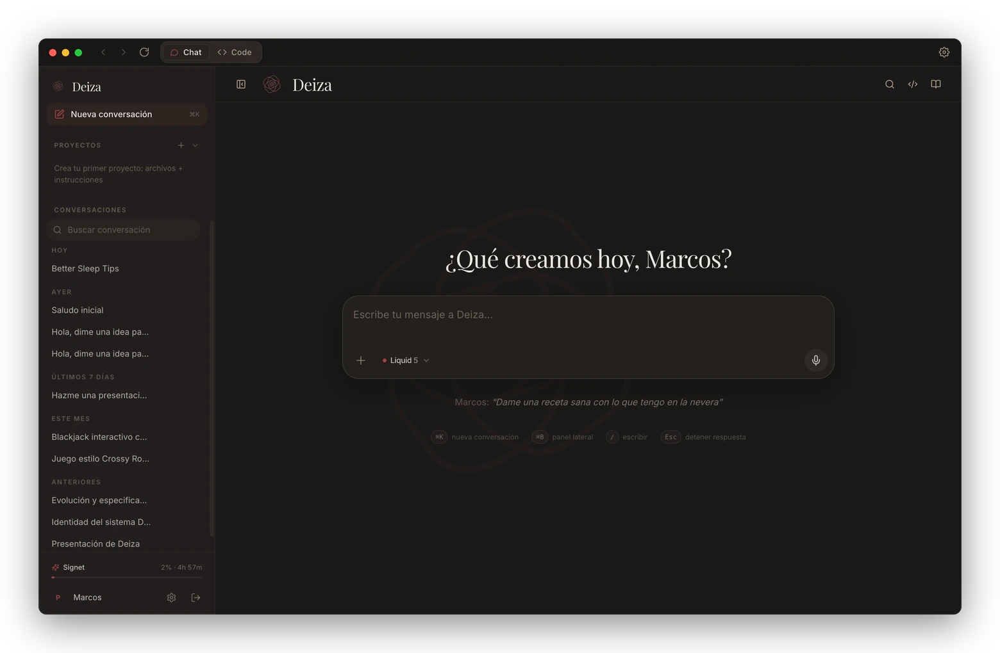
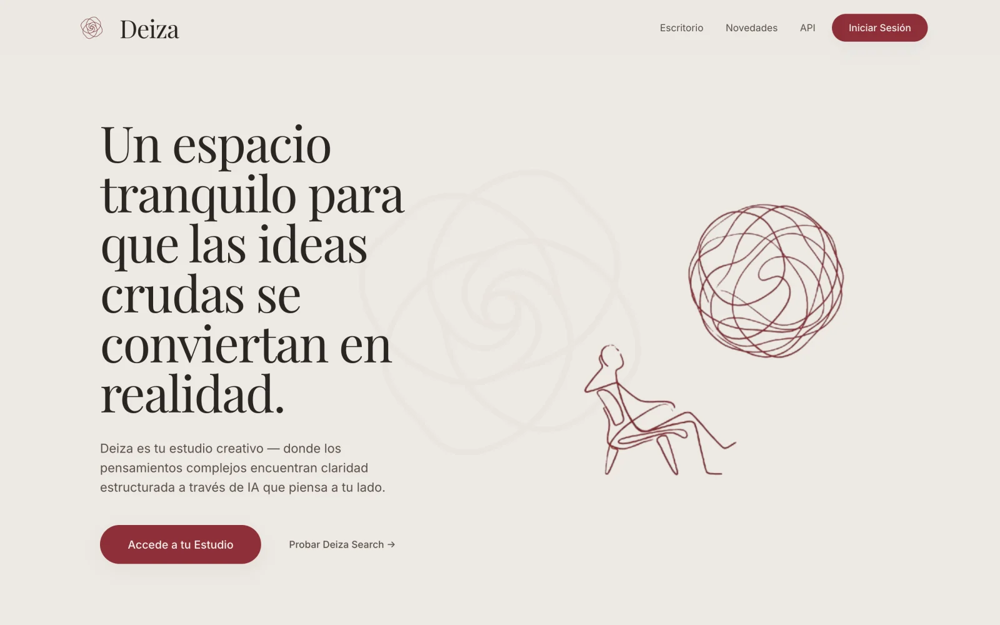
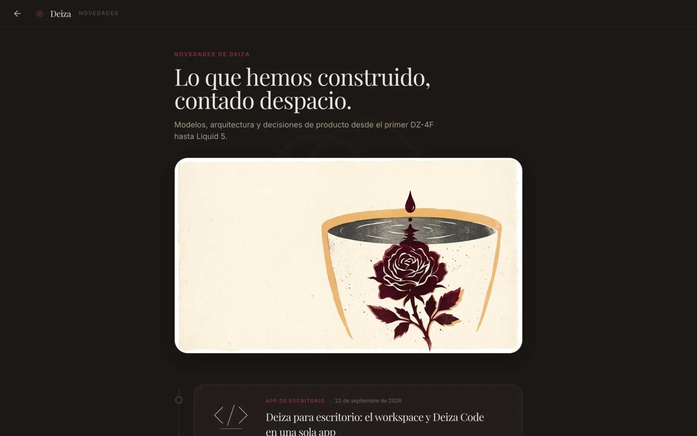
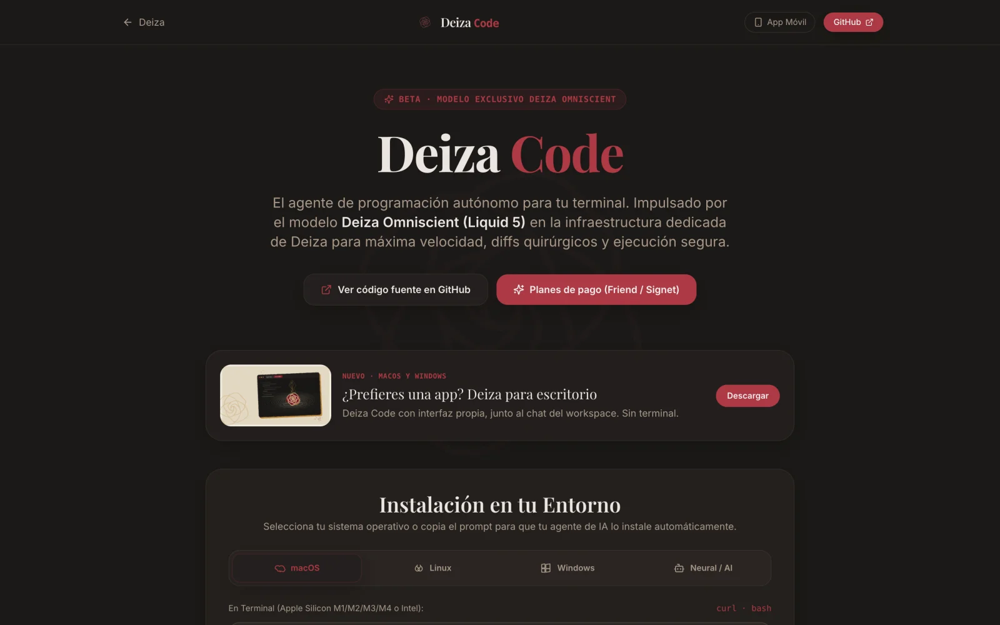

# Deiza Core

El código de [deiza.org](https://deiza.org): el workspace de Deiza y el backend que lo sirve, con chat, documentos, presentaciones, imagen, vídeo, búsqueda, voz y el endpoint de Deiza Code.

Es compatible con cualquier endpoint y API. Cada URL, clave y modelo sale de un `.env` hipercustomizable: puedes apuntarlo a tu propia API, a un gateway con varios proveedores detrás o a un modelo que sirvas tú mismo, y cambiar de uno a otro sin tocar código.

[deiza.org](https://deiza.org) · [Deiza para escritorio](https://github.com/marcosdeaza/Deiza-App) · [Deiza Code (CLI)](https://github.com/marcosdeaza/deiza-code)



## Capturas

| | |
|---|---|
|  |  |
| **Portada.** Tipografía editorial, papel cálido y la rosa como firma. | **Novedades.** Cada versión contada con calma, en español e inglés. |
|  | |
| **Deiza Code.** Instalación del agente y de la app de escritorio. | |

## Qué incluye

**Workspace**
- Chat en streaming con cuatro familias de modelo: Vainilla, Gas, Liquid y Solid, con razonamiento visible cuando el modelo lo ofrece.
- Artefactos en un panel lateral: HTML con vista previa, proyectos en ZIP, código, documentos y presentaciones.
- Proyectos con archivos e instrucciones propias, memoria del usuario y skills importadas en Markdown.
- Conversaciones y artefactos compartibles como instantáneas de solo lectura.

**Documentos y presentaciones**
- `backend/deiza_mapper`: motor HTML-first que genera PDF, DOCX y PPTX con temas, fotos verificadas y maquetación a medida, renderizado con Chromium.

**Imagen, vídeo y voz**
- Generación y edición de imágenes a partir de fotos adjuntas.
- Clips de vídeo y reels encadenados con continuidad entre escenas.
- Dictado con transcripción en paralelo para grabaciones largas y lectura en voz alta.

**Búsqueda**
- Deiza Search sobre un SearXNG propio: respuesta con fuentes, imágenes, compras y cotizaciones.

**Deiza Code**
- Endpoint compatible con OpenAI en `/api/code/chat/completions` para el [CLI](https://github.com/marcosdeaza/deiza-code) y la [app de escritorio](https://github.com/marcosdeaza/Deiza-App), con claves `dz_` por usuario.
- La conversación se ajusta sola a la ventana de contexto de cada modelo y los cortes del proveedor se reintentan antes de llegar al usuario.

**Cuentas y planes**
- Inicio de sesión con Google, Apple o enlace mágico por email.
- Planes con Stripe, códigos regalo y límites de uso por ventana.

**Plataforma**
- Interfaz en 12 idiomas, PWA y envoltorio iOS con Capacitor.

## Arquitectura

```
navegador ── nginx (TLS, SSE) ──┬── SPA React (estático)
                                └── Flask + Gunicorn ──┬── MODEL_API_URL   chat, documentos, imagen, vídeo, voz
                                                       ├── CODE_API_URL    Deiza Code y Vainilla (formato OpenAI)
                                                       ├── SearXNG         búsqueda
                                                       ├── Redis
                                                       └── SQLite (o cualquier base vía DATABASE_URL)
```

| Ruta | Contenido |
|---|---|
| `src/` | React 18, Vite, Tailwind y shadcn/ui. Páginas en `src/pages`, componentes propios en `src/components/deiza`, textos en `src/i18n`. |
| `backend/app.py` | Rutas de la API, streaming SSE, planes, compartir y el proxy de Deiza Code. |
| `backend/ai_service.py` | Construcción de prompts, llamadas a modelos, artefactos, imagen y vídeo. |
| `backend/speech_service.py` | Dictado y lectura en voz alta. |
| `backend/search_service.py` | Deiza Search. |
| `backend/deiza_mapper/` | Motor de documentos y presentaciones. |
| `backend/auth.py` | Sesiones, Google, Apple y enlace mágico. |
| `nginx/`, `searxng/`, `docker-compose.yml` | Despliegue. |

## Configuración

Todo se define en `backend/.env` (plantilla completa en [`backend/.env.example`](backend/.env.example)) y, para el frontend y SearXNG, en `.env` ([`.env.example`](.env.example)).

| Variable | Para qué |
|---|---|
| `MODEL_API_URL` | Plantilla del endpoint de modelos, con `{model}` y `{action}`. Las acciones son `generateContent` y `streamGenerateContent`; cualquier API o gateway que las hable sirve. |
| `MODEL_API_KEY`, `MODEL_API_AUTH` | Clave y cómo se envía: `query`, `bearer` o `header:Nombre`. |
| `MODEL_GAS`, `MODEL_LIQUID`, `MODEL_SOLID`, … | Qué modelo hay detrás de cada nivel. |
| `MODEL_FALLBACKS` | Cadena de respaldo por modelo, en JSON. |
| `IMAGE_*`, `VIDEO_*`, `STT_*`, `TTS_*` | Modelos (y URL, si es otra) de imagen, vídeo y voz. |
| `CODE_API_URL`, `CODE_API_KEY`, `CODE_MODEL_*` | Endpoint `chat/completions` compatible con OpenAI para Deiza Code y Vainilla. |
| `FLASK_SECRET_KEY`, `FRONTEND_URL`, `DATABASE_URL` | Servidor. |
| `GOOGLE_CLIENT_ID`, `RESEND_API_KEY` o `SMTP_*` | Inicio de sesión. |
| `STRIPE_*` | Pagos, opcionales. |

## Puesta en marcha

Con Docker:

```bash
cp .env.example .env
cp backend/.env.example backend/.env    # como mínimo: FLASK_SECRET_KEY, MODEL_API_URL, MODEL_API_KEY y los modelos
docker compose up -d --build
```

`nginx/nginx.conf` está preparado para `deiza.org` con certificados de Let's Encrypt: cambia el dominio y las rutas de los certificados por los tuyos.

En desarrollo:

```bash
# backend
cd backend
python3 -m venv .venv && . .venv/bin/activate
pip install -r requirements.txt && python -m playwright install chromium
gunicorn --bind 127.0.0.1:5000 --worker-class gthread --threads 8 app:app
```

```bash
# frontend, en otra terminal (envía /api y /auth a DEIZA_DEV_BACKEND)
npm install
npm run dev
```

## Licencia

[MIT](LICENSE) © Marcos de Aza
